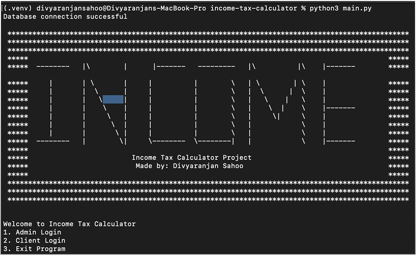

---
# Income Tax Calculator
---

## Description

This project was created when I was in **Class 11 and had just started learning Python. It was my **first big project\*\*, and it took a lot of time, experimentation, and debugging to get it working.

It took a lot of time, debugging, and trial-and-error, but I kept going because I wanted to learn. Today, the code **is not production-standard**, but it remains an important part of my Python learning journey.

This project is a humble demonstration of how programming can be used for **real-world applications**, even as a beginner.



---

## Features

Here are the main features I tried to include in the project:

- **Computerized voice output** using `pyttsx3` (the program can read out few sentences).
- **Income tax calculations** for clients.
- **Database storage** of client details using **MySQL**.

---

### Dependencies

This project uses the following Python libraries:

- `mysql-connector-python`
- `pyttsx3`
- `Built-in Python modules:` `sys`, `csv`, `urllib.request`

All required packages are included in `requirements.txt`.

---

### Installation

Follow these steps to set up and run the project:

1. **Install Python** (if not installed)

   - Download and install Python from [https://www.python.org/](https://www.python.org/).
   - Make sure Python 3 is installed on your system.
   - You can check by running:

   ```console
   divyaranjan@DESKTOP-IHSUHK:~$ python --version
   Python 3.8.10
   ```

2. **Clone this repository**

   ```bash
   git clone <repository-url>
   cd <repository-folder>
   ```

3. **Create a Virtual Environment** (Optional)

   ```bash
   python -m venv venv
   source venv/bin/activate   # On Linux/Mac
   venv\Scripts\activate      # On Windows
   ```

4. **Install Dependencies**

   ```bash
   pip install -r requirements.txt
   ```

5. **Set Up MySQL Database**

   - Install MySQL Server (if not already installed).
   - Create a database (for example: _incometax-db_).
   - Update the connection details (_host, user, password, database name_) in the Python code file where database connectivity is configured.

---

### How to Run

Once everything is set up:

1. Start your MySQL server.
2. Run the project script:

   ```bash
   python main.py
   ```

3. Follow the interactive menu to explore user or admin options.

---

## Notes

- This project is **for learning purposes only**.
- It is **not optimized for production**.
- You are welcome to explore, modify, and extend the code to improve it.
